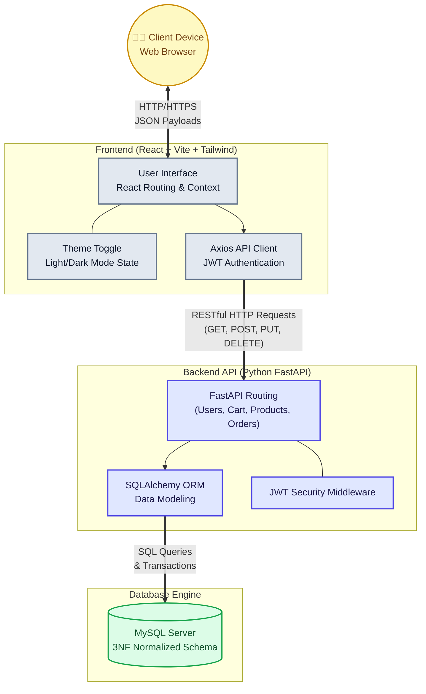

# ShopSphere E-Commerce: Full-Stack DBMS Architecture

This project is a deeply engineered, production-ready full-stack e-commerce engine utilizing a 3NF normalized MySQL relational schema, a Python FastAPI backend, and a modern React + Vite glassmorphism frontend.

## 🚀 Key Features & Highlights

- **3NF Relational Database**: Strictly scaled database logic enforcing constraints, cascading relations, and separating analytical computations to avoid anomalies.
- **Automated Database Triggers**: Uses SQL `AFTER INSERT` triggers to atomically debit inventory stocks at the moment of order placement.
- **RESTful FastAPI Architecture**: Secured via JWT tokens with separated structural routers (`/auth`, `/cart`, `/orders`, `/products`, `/sellers`).
- **Premium Glassmorphism Frontend**: Features dynamic Light/Dark mode state manipulation built cleanly inside React and managed strictly with Tailwind CSS dynamic contexts.
- **Seller Extensibility**: Implements localized seller dashboards parsing aggregation logic dynamically from MySQL `VIEWS`.

---

## 🏗️ System Architecture

Our subsystem is divided explicitly into a Client Interface, an API router, and a Data Persistence layer:



---

## 🛠️ Installation & Testing

You can boot up both the frontend and backend servers utilizing the bundled batch script.

### Prerequisites
- Python 3.10+
- Node.js & NPM
- MySQL Server operating locally

### Launch Command
If operating on Windows, simply execute:
```bash
run_servers.bat
```
*(This automatically spawns uvicorn onto `localhost:8000` and Vite onto `localhost:5173` while providing terminal-level feedback).*

Alternatively, install the ecosystems independently:

#### Backend
```bash
cd backend
python -m venv .venv
source .venv/bin/activate  # (Or .venv\Scripts\activate on Windows)
pip install -r requirements.txt
uvicorn main:app --reload --port 8000
```
#### Frontend
```bash
cd frontend
npm install
npm run dev
```

## 🗄️ Database Implementation

All tables, relational models, primary/composite keys, and Views are defined directly inside `schema.sql`. You can initialize the raw unmapped tables by piping it directly into your MySQL CLI instance:
```bash
mysql -u root -p EcommerceDB < schema.sql
```
*(Alternatively, simply run `python backend/init_db.py` to allow SQLAlchemy to execute automated schema generation against mapped Base models).*
